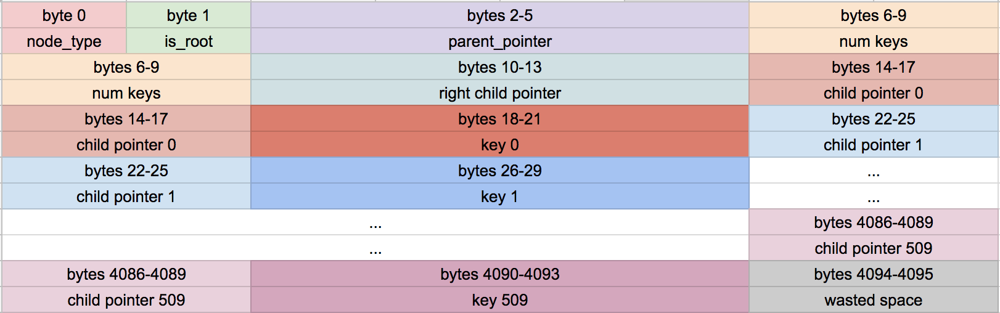

## Bug Description

An infinite loop was created when printing out the b-tree structure following the split of an internal node.

## Background

I was verifying the logic for splitting an internal node in a B-tree for my database program. For this, I created a two-level b-tree with a full root and a full leaf node, then proceeded to insert a key into the full leaf node. This would trigger the leaf node to split and add a key into the root, and therefore cause an internal node split.

The tree I was working with is shown below. For demonstration purposes, only the keys are shown. In this tree, the max number of keys in the leaf and internal nodes were 13 and 3 respectively. It is seen that **both the root and the rightmost leaf node are full** before the insertion of key 75.


*B-tree before split.*


*B-tree after inserting and splitting. A new level is created from the split.*

<!-- - An internal node was represented as a byte-array of 4096 bytes. The front of the byte array acts as a header and stores metadata such as the number of keys in the node. This is followed by pairs of child pointers and keys.


*Source: [CStack's Let's Build a Simple Database - Part 10](https://cstack.github.io/db_tutorial/parts/part10.html)* -->

## Investigation

**Root Cause**: **The number of keys in the internal node being split was not being updated prior to key insertion.** This created a bug that resulted in a circular reference back to the root, causing an the infinite loop when traversing through the tree. 

**Analysis**

First, I looked at the tree printout to see what was being repeated. It was observed that when traversing the right side of the tree, one of the child pointers went back to the root. 

```bash
db > .btree # prints b-tree following inorder traversal
- internal (size 1) (ROOT)
  - internal (size 1) (pg index 7)
    - leaf (size 8) (pg index 2)
    - key 22
    - leaf (size 7) (pg index 3)
  - key 35
- internal (size 2) (pg index 6)
- internal (size 1) (ROOT) # circular reference back to the root
```

This is illustrated with the image below.

*The right node has a child pointer to that points back to the root.*

To understand the logic of the node splitting, I added print statements to see which child/key pairs were being updated. From this I discovered errors:

```bash
db > INSERT 75 user75 user@email.com # (user id, name, email)

---Inserting into internal node that is full, splitting---

---Internal node is empty, setting right child---

# THIS IS CORRECT
cells of node 0x7fecef00b200
    Right child -> child index 1

---Inserting cell (child pg idx: 4, key: 51) at cell 0 (total keys 0)---

# THIS IS INCORRECT
cells of node 0x7fecef00b200
    Right child -> child index 4 # expected: child index 1

---Updating num keys---

# THIS IS INCORRECT
cells of node 0x7fecef00b200
    Cell {0} -> child index 0, key 51 # expected: child index 4, key 51
    Right child -> child index 4 # expected: child index 1
```

If you look carefully at the following line:
```bash
---Inserting cell (child pg idx: 4, key: 51) at cell 0 (total keys 0)---
```

you'll see that when inserting key 51, the program checks the node header for the number of keys and reads `0`. 

In an internal node with `n` keys, there are child/key pairs from cells `i = 0` to `i = n - 1`. The cell at `i = n` actually references the right child pointer.

Since the number of keys was read as `0`, instead of writing into cell `i = 0`, the program overwrote the right child pointer instead.

Then after the number of keys is incremented, you can see that cell `i = 0` now exists, but **its child pointer is initialized to 0 which points to the root node. This is what is causing the circular reference.** 

## Fix

The fix is to increment the number of keys before performing the insert:

```c
void internal_node_insert(Table *table, uint32_t parent_idx, uint32_t child_idx)
{
    /*
    Add a new child/key pair to parent that corresponds to child
    note: parent_idx and child_idx are nodes represented by page indexes
    */

    // ... existing code ...

    /* CORRECT SPOT */
    /* Update the number of keys in the node header */
    *internal_node_num_keys(parent) = original_num_keys + 1;

    if (max_key > get_node_max_key(table->pager, right_child))
    {
        /* Insert child pointer at right child */
        *internal_node_child(parent, original_num_keys) = right_child_idx;
        *internal_node_key(parent, original_num_keys) = get_node_max_key(table->pager, right_child);

        *internal_node_right_child(parent) = child_idx;
    }
    else
    {
        /* Insert child pointer, key pair within cells */
        for (uint32_t i = original_num_keys; i > idx_to_insert; i--)
        {
            void *dest = internal_node_cell(parent, i);
            void *src = internal_node_cell(parent, i - 1);
            memcpy(dest, src, INTERNAL_NODE_CELL_SIZE);
        }

        *internal_node_child(parent, idx_to_insert) = child_idx;
        *internal_node_key(parent, idx_to_insert) = max_key;
    }
    
    /* INCORRECT SPOT */
    // *internal_node_num_keys(parent) = original_num_keys + 1;
}
```